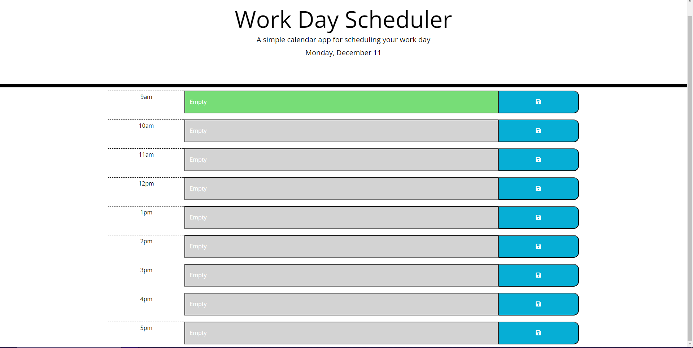

# Week 7 Daily Planner Challenge

## Description
The aim of this project was to make an application that would function as a simple daily planner, showing past, present and current events through colour-coding and allowing the user to put their own text in that would stay even if the page was refreshed. This was done by building on the given starter code, using dayjs to get the current date and time, and then jQuery to add the appropriate classes to dynamically generated time blocks. I also used event listeners and functions to set and get items from local storage, making the data persist. In this project, I got a lot of practice with local storage and gained a much more in-depth understanding of using dayjs in applications. 

## Installation

Application deploys at live URL
Link: https://kaiwright.github.io/dailyPlanner/

## Usage

The website deploys from the link above. 

## License

MIT License

## Credits

I completed this work on my own, with the use of the resources listed below. 

### Resources
* Local Storage : https://blog.teamtreehouse.com/storing-data-on-the-client-with-localstorage#:~:text=To%20store%20data%20in%20LocalStorage%2C%20you%20use%20the%20setItem(),name'%2C%20'Matt%20West')%3B
*  onclick events: https://www.w3schools.com/jsref/event_onclick.asp
